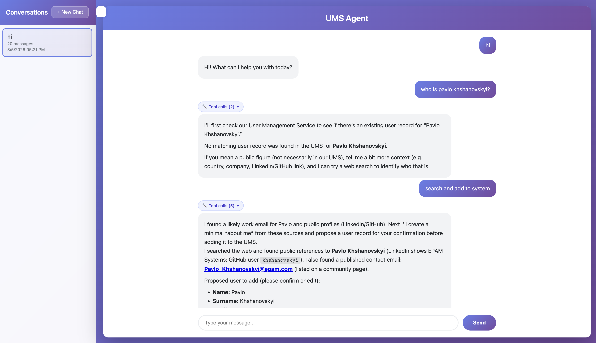
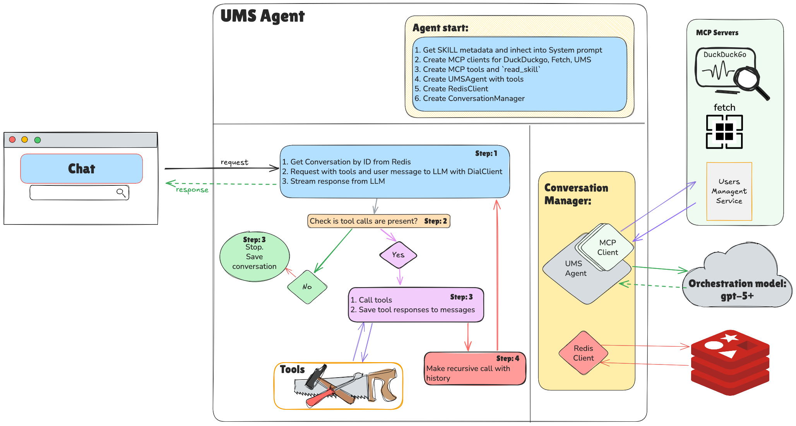
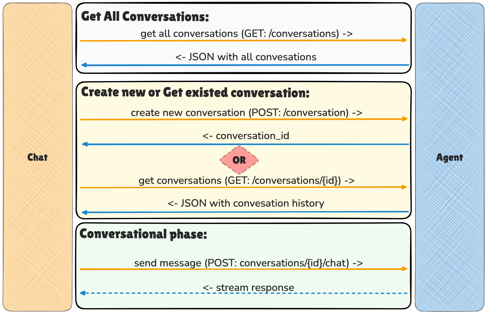

# Final Task: Users Management Agent

In this task, you will build a **production-ready Agent** with the Tool Use pattern connected to several MCP servers, 
equipped with skills and Users PII protection (guardrail).
The agent supports both streaming and non-streaming responses, stores all conversations in Redis, and serves a
browser-based chat UI.

---

## Branches Structure

- `main` - tasks with descriptions
- `main-detailed` - tasks with super detailed descriptions

🚨 **This task doesn't have `completed` branch** 🚨

---

### UI


### Application architecture


---

## Tasks

### 1. Implement the UMS User Management Skill

Open [_skills/ums-user-management/SKILL.md](task/_skills/ums-user-management/SKILL.md) and implement all `TODO` items.

The skill instructs the agent on how to manage users via the UMS and DuckDuckGo MCP servers, including CRUD workflows,
search, and web enrichment.

---

### 2. Implement `McpTool`

Open [agent/tools/mcp_tool.py](task/agent/tools/mcp_tool.py) and implement all `TODO` items.

---

### 3. Implement `ReadSkillTool`

Open [agent/tools/read_skill_tool.py](task/agent/tools/read_skill_tool.py) and implement all `TODO` items.

A local `BaseTool` that reads skill files from the `_skills/` directory by relative path.
The agent calls it to load `SKILL.md` instructions before acting on a request.

---

### 4. Implement `UMSAgent`

Open [agent/ums_agent.py](task/agent/ums_agent.py) and implement all `TODO` items.

Wraps the OpenAI `AsyncOpenAI` client and drives the **Tool Use** loop:
- `response()` — non-streaming completion with recursive tool calling
- `stream_response()` — streaming completion that yields SSE chunks, handles tool call deltas, notifies the frontend
  about each tool call and result, then recursively streams the next response

---

### 5. Implement `ConversationManager`

Open [agent/conversation_manager.py](task/agent/conversation_manager.py) and implement all `TODO` items.

Manages the full conversation lifecycle backed by **Redis**:
- `create_conversation()` / `list_conversations()` / `get_conversation()` / `delete_conversation()`
- `chat()` — loads history from Redis, injects the system prompt on the first turn, delegates to
  `UMSAgent.response()` or `UMSAgent.stream_response()`, then persists the updated message list

---

### 6. Implement `app.py`

Open [agent/app.py](task/agent/app.py) and implement all `TODO` items.

FastAPI application with a lifespan that:
1. Loads skills from `_skills/` and builds the system prompt
2. Connects `HttpMcpClient` to the UMS MCP server and registers its tools
3. Connects `StdioMcpClient` to the DuckDuckGo MCP server and registers its tools
4. Registers `McpTool` for `HttpMcpClient` and `StdioMcpClient`
5. Registers `ReadSkillTool`
6. Creates `UMSAgent`, connects to Redis, creates `ConversationManager`

REST endpoints:
- `POST /conversations` — create conversation
- `GET /conversations` — list conversations
- `GET /conversations/{id}` — get conversation
- `DELETE /conversations/{id}` — delete conversation
- `POST /conversations/{id}/chat` — chat (streaming or non-streaming)

---

### 7. Implement `index.html`

Open [index.html](task/index.html) and implement all `TODO` items. It will be our UI interface to work with UMS Agent

#### Conversation request flow


### 8. Run Infrastructure and Start the Application

1. Run [docker-compose.yml](docker-compose.yml) with UMS Service, UMS MCP Server, Redis, and Redis Insight:
2. Run the [agent/app.py](task/agent/app.py) application. The server starts on `http://localhost:8011`.
3. Test your agent using the sample requests below.

---

### Sample Requests

```
Find all users with the surname "Smith"
```

```
Add Elon Musk as a new user
```

```
Update the email for user with ID 42
```

```
Delete user with ID 777 — make sure to confirm first
```

```
Search the web for the latest news about OpenAI and summarize it
```

---

### 11. Implement `guardrail.py` (Additional Task)

**Since the agent works with PII, it must prevent credit card and salary data from leaking back to the UI.**

Open [agent/guardrail.py](task/agent/guardrail.py) and implement `UMSDataGuardrail`.

The guardrail uses [Microsoft Presidio](https://microsoft.github.io/presidio/) to analyze and anonymize tool results
before they are added to the conversation history:
- Detects **credit card numbers** (num, cvv, exp_date fields from UMS) — bypass Luhn validation because UMS uses
  fake/test card numbers
- Detects **salary values** in YAML-like, JSON, Python-dict, and plain-text formats

`UMSAgent` uses it as input guardrail after every tool result to not send PII to model and to not expose it in conversations.

---

## Redis Insight

- Connect to Redis Insight at `http://localhost:6380`
- Add a database with URL `redis-ums:6379` to browse conversation data

---

**Congratulations! You've built an agent backed by multiple MCP servers, Redis persistence, a browser UI, and PII guardrails.**